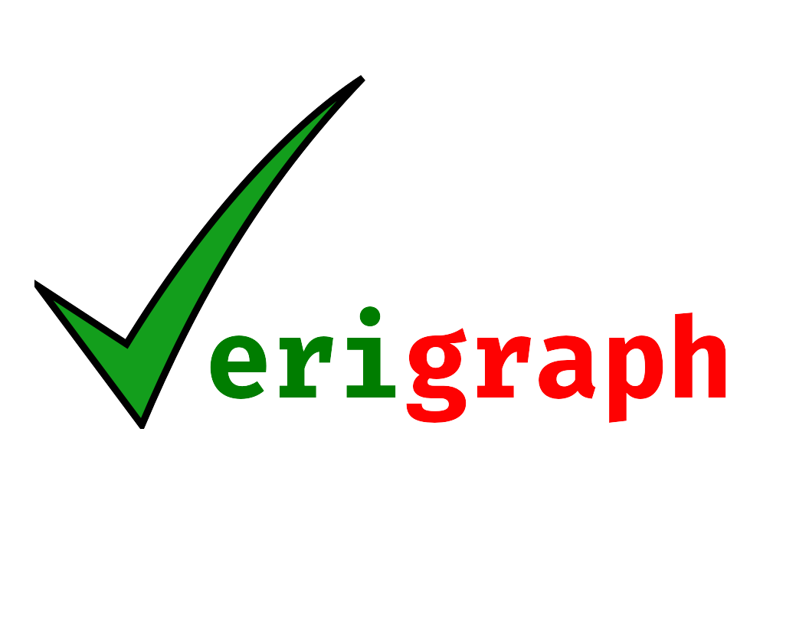

# Verigraph

[](https://travis-ci.org/Verites/verigraph)
[](https://coveralls.io/github/Verites/verigraph?branch=master)
[](https://codeclimate.com/github/Verites/verigraph)
[](https://codeclimate.com/github/Verites/verigraph)



Software specification and verification tool based on graph rewriting.

[](https://github.com/Verites/verigraph/releases/latest)
[](https://zenodo.org/badge/latestdoi/22760294)
[](https://github.com/Verites/verigraph/blob/master/LICENSE)

## Tutorial

In depth "how to" tutorials are available for each stable version at [Releases](https://github.com/Verites/verigraph/releases).

## Quick Start

### Installing via Stack

First you must assure that `stack` is in **version 1.6.0 or later**. 
You can check the `stack` version with the command:

```bash
   $ stack --version
```
If the stack version is older, you can upgrade it by running:

```bash
  $ stack upgrade
  $ echo "export PATH=~/.local/bin:${PATH}" >> ~/.bashrc
  $ source ~/.bashrc
```

You may remove the previous installed stack package.
Once you have cloned this repository, install `verigraph` by running:

```bash
  $ stack setup # Will download and configure ghc if it is not installed yet
  $ stack install
```

If there is an error saying `/usr/bin/ld: cannot find -ltinfo`, it means you don't have `libtinfo.so` in your `/usr/lib` directory
(see https://github.com/judah/haskeline/issues/57).
You may install the lib package to fix this (In ubuntu the package `libtinfo-dev` installs this lib), and then run `stack install` again

If there is an error saying `recompile with -fPIC`, it can be fixed by the following command
(see https://github.com/commercialhaskell/stack/issues/2712).

```bash
  $ shopt -s globstar && sed -i 's/-fno-PIE/-no-pie/g' ~/.stack/programs/**/ghc-*/settings`
```


### Installing via Cabal

Once you have cloned this repository, install `verigraph` by running:

```bash
  $ cabal install
  $ echo "export PATH=${PATH}:~/.cabal/bin" >> ~/.bashrc
  $ source ~/.bashrc
```

### Usage

Run verigraph helper:

```bash
  $ verigraph --help
```

Some example grammars are provided in the `grammars` directory, try something like:

```bash
  $ verigraph analysis grammars/Pacman/pacman.ggx
```

If you use bash, you can enable autocompletion of verigraph options for the current
session by running the following command.

```bash
  $ source <(verigraph --bash-completion-script "$(which verigraph)")
```

## Modelling and Visualization

We use [AGG](http://www.user.tu-berlin.de/o.runge/agg/) to read and write the .ggx
and .cpx files with the Graph Grammars and their analysis.

## Contributing

We encourage you to contribute to Verigraph. Please check out the [Contributing guidelines](CONTRIBUTING.md) about how to proceed.

Everyone interacting in Verigraph and/or its tutorials, sub-projects' codebases and issue trackers is expected to follow the [Contributor Covenant Code of Conduct](CODE_OF_CONDUCT.md).

## License

Verigraph is released under the [Apache 2.0 License](LICENSE)
